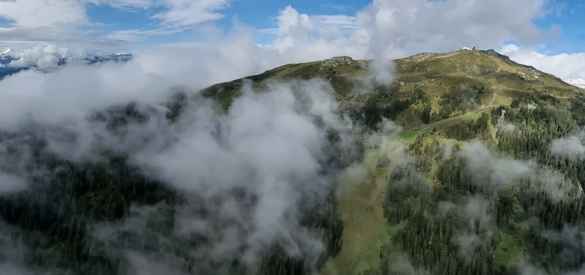
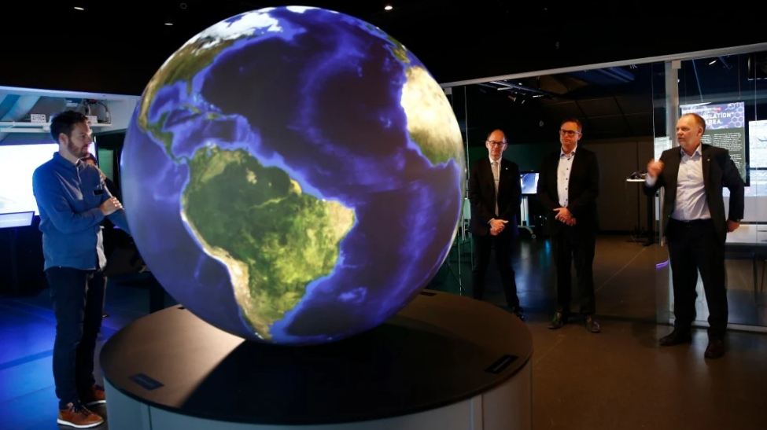
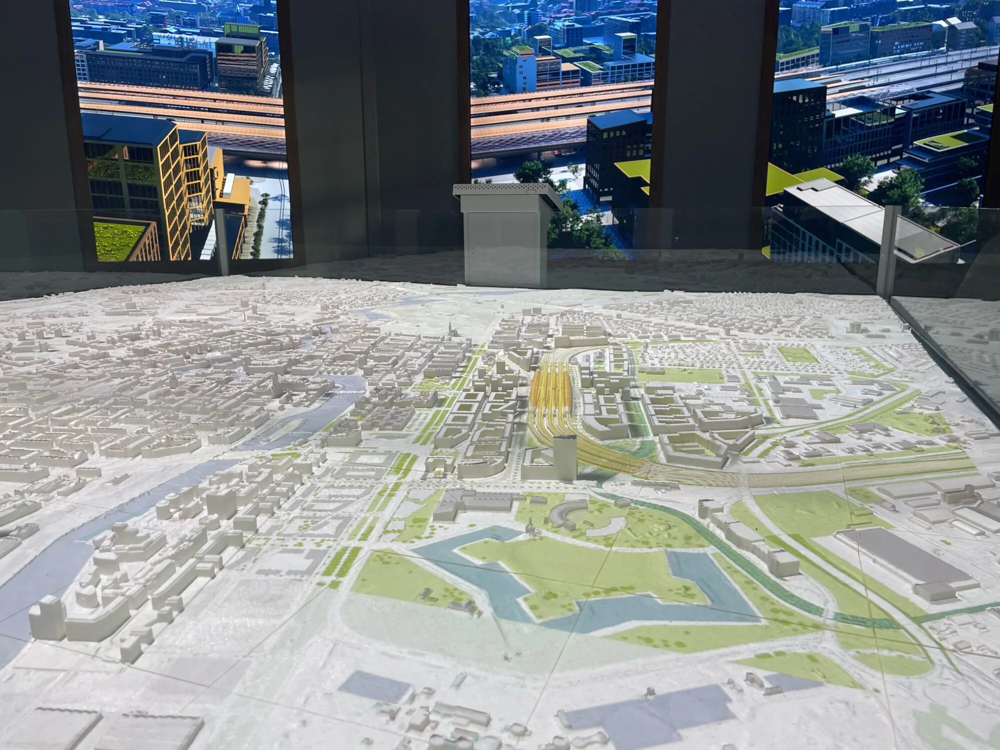



Next conference is being held on **5-6 October 2026** in **Switzerland**. Additionally, an additional workshop day is being planned for the **7th October**.

## Organizers & Sponsors


## Venue

The event will be held at the [Visualization Center C](https://www.visualiseringscenter.se/en/), [Cnema](https://cnema.se/)
and [Campus Norrköping](https://liu.se/en/article/campus-norrkoping) of [Linköping University](https://liu.se/en). These are
situated in the heart of Norrköping, a city with a rich industrial history and beautiful water displays right outside
the venues.














