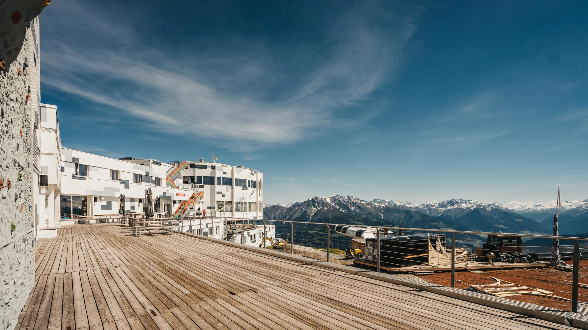
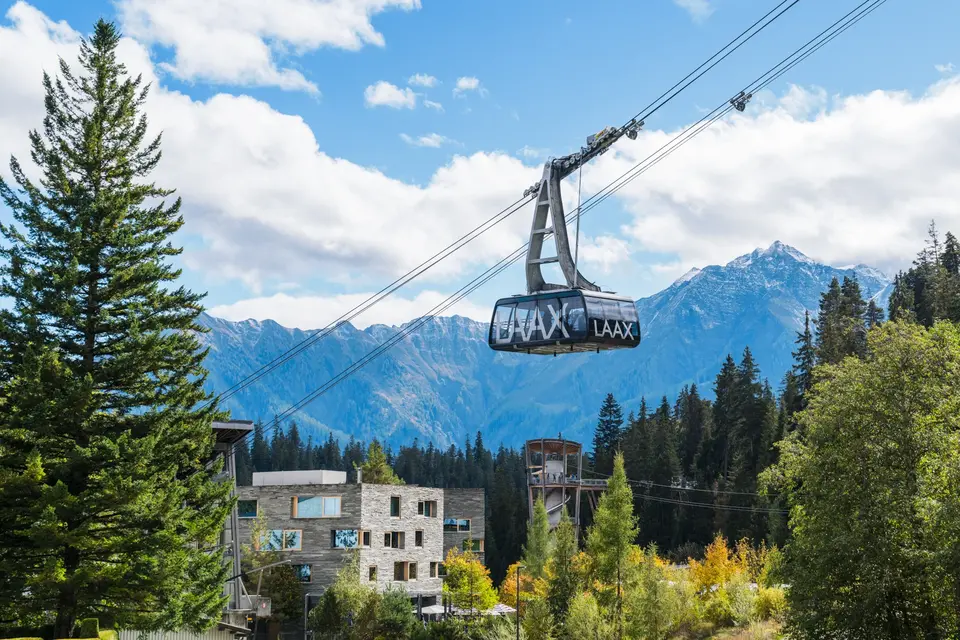
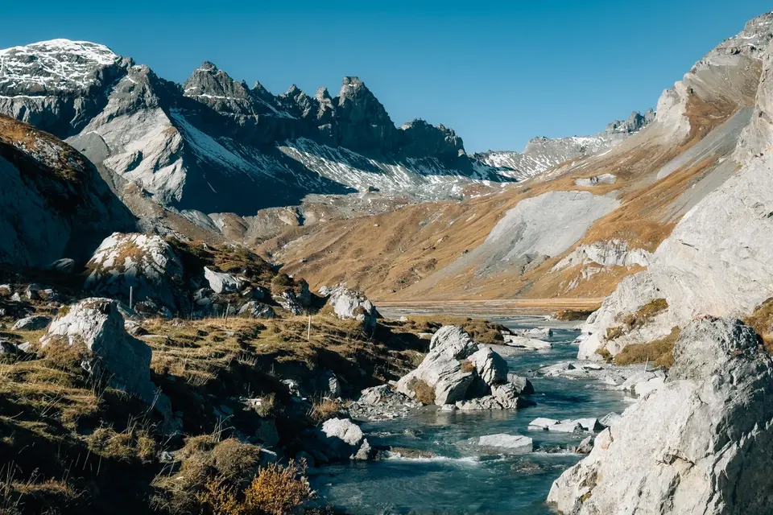



The next conference will take place on **5–6 October 2026** in **LAAX, Switzerland**.
In addition, a **workshop day** is planned for the 7th October, along with an **informal active outdoor pre-event day** on the 4th October.

## Organizers & Sponsors


## Venue

The event will be held at [**LAAX Galaaxy**](https://www.galaaxylaax.com/) on **Crap Sogn Gion**, at **2,222 m above sea level**, in the heart of the Swiss Alps.
The event will be held at LAAX Galaaxy
 on Crap Sogn Gion, at 2,222 m above sea level, in the heart of the Swiss Alps

Set right next to the [**Tectonic Arena Sardona**](https://www.flimslaax.com/en/outdoor-activities/natural-phenomena/tectonic-arena-sardona) UNESCO World Heritage Site, the venue offers breathtaking panoramic views over the surrounding mountain landscape of the Surselva valley, one of the few [Romansh-speaking](https://en.wikipedia.org/wiki/Sursilvan) regions in Switzerland.

Beyond the conference, the region is a true [outdoor playground](https://www.flimslaax.com/en/outdoor-activities/). Participants can enjoy **mountain biking** and **hiking** and **paragliding** flights directly from the venue, and refreshing breaks at [**Caumasee**](https://www.flimslaax.com/en/outdoor-activities/mountain-lakes/lake-cauma), one of Switzerland’s most iconic mountain lakes. Nearby, the [**Rhine Gorge**](https://www.flimslaax.com/en/outdoor-activities/natural-phenomena/rhine-gorge), often called the Swiss Grand Canyon, adds another spectacular highlight with its dramatic cliffs and turquoise waters.














