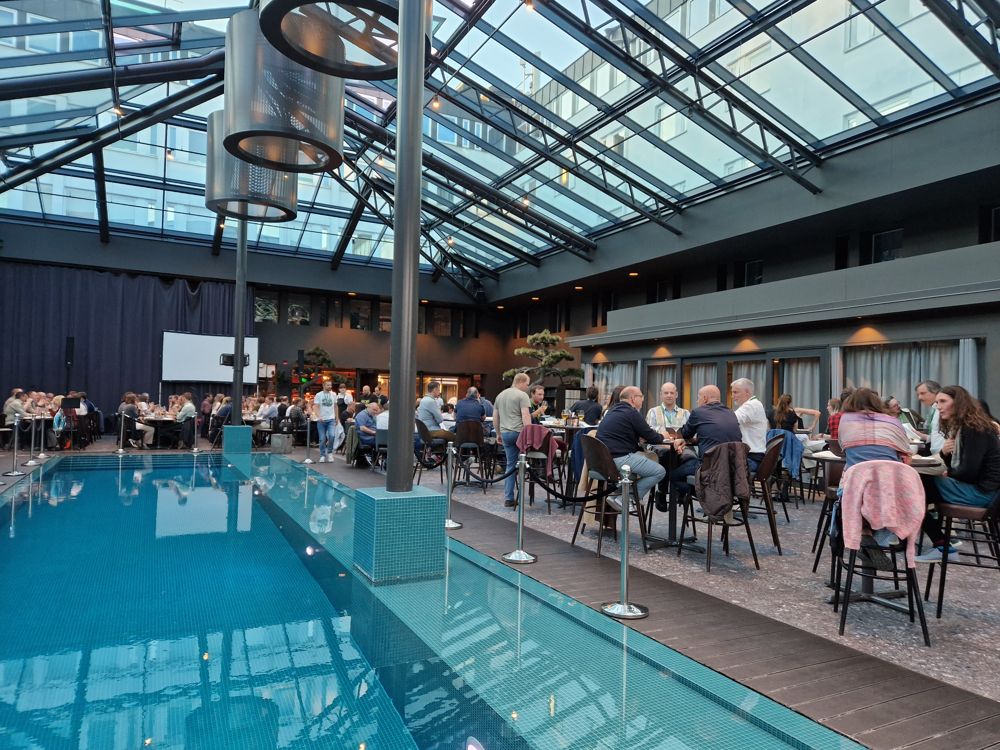
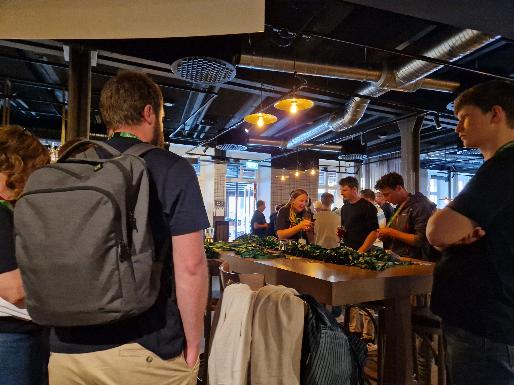



## Thank you!

The QGIS User Conference 2025 has ended. We would like to thank all the participants, speakers, and sponsors for making this event a success!

Missed the conference or specific presentations? Watch them [here](https://www.youtube.com/playlist?list=PLi6mvse6ZEOx3REy1Dr0JFOWxVOxkqEY7)!

Next conference is being held on **5-6 June 2026** in **Switzerland**. Additionally, an additional workshop day is being planned for the **7th October**.

























## Organizers & Sponsors


## Venue

The event will be held at the [Visualization Center C](https://www.visualiseringscenter.se/en/), [Cnema](https://cnema.se/)
and [Campus Norrköping](https://liu.se/en/article/campus-norrkoping) of [Linköping University](https://liu.se/en). These are
situated in the heart of Norrköping, a city with a rich industrial history and beautiful water displays right outside
the venues.














