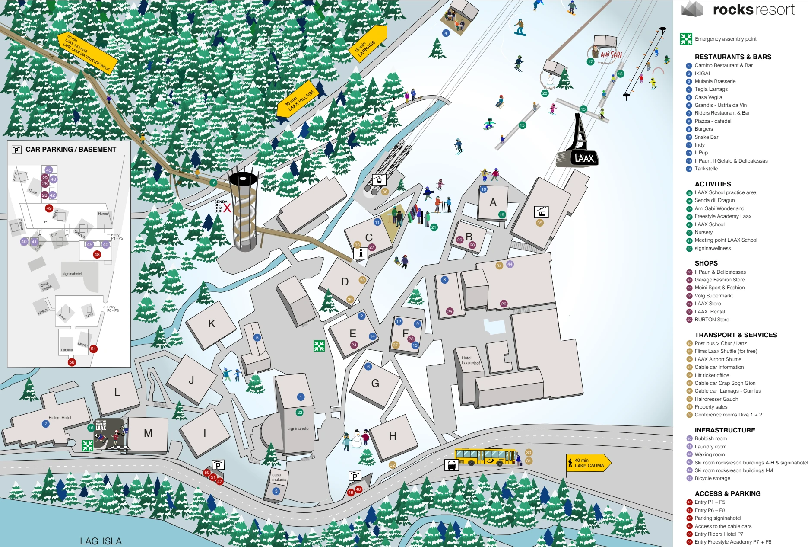
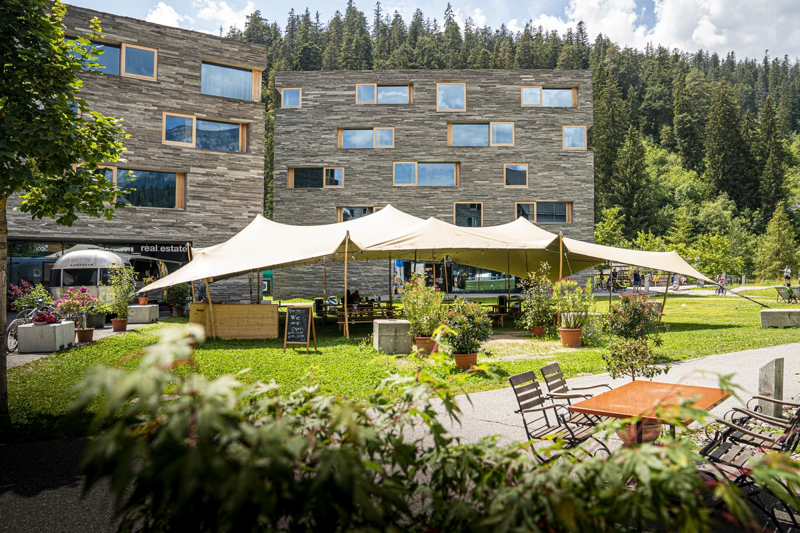
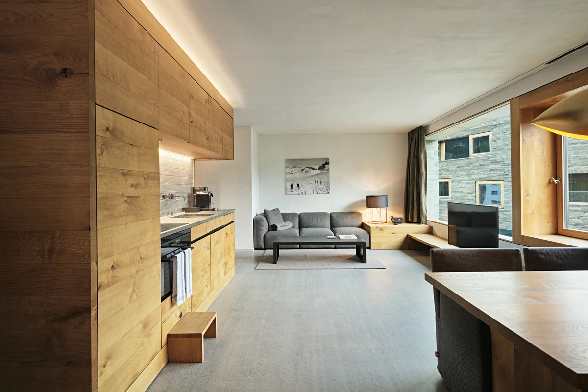
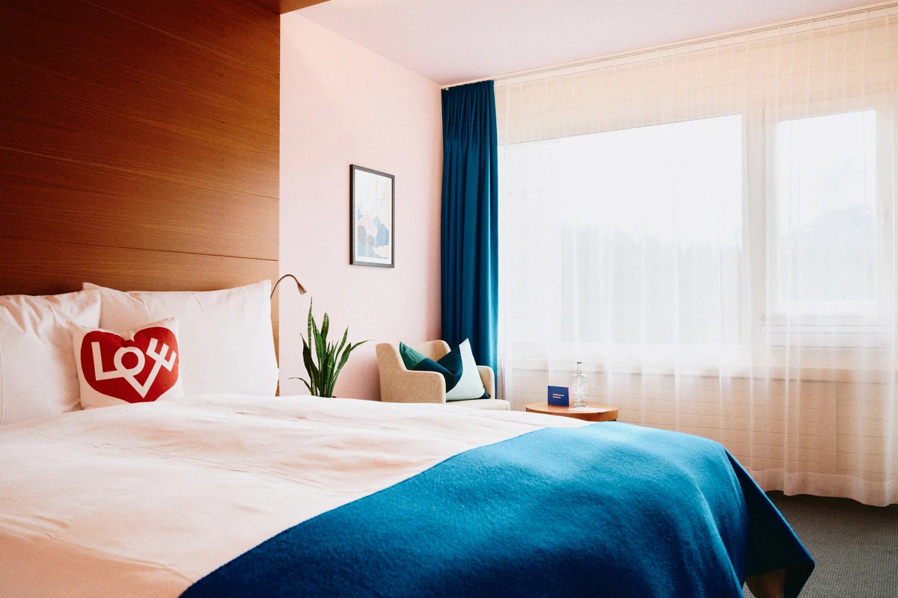
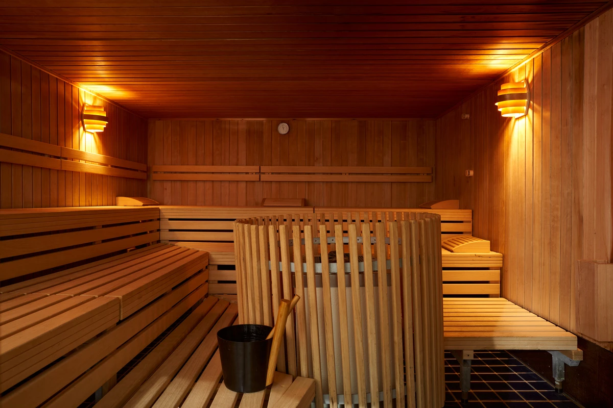
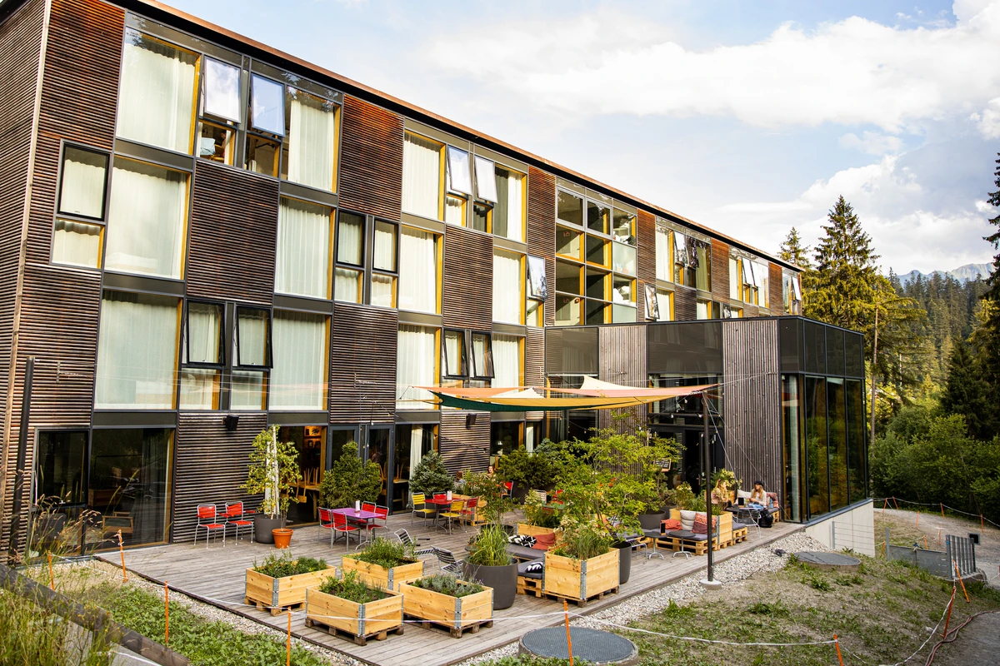



# Accommodation




Participants must arrange and pay for their own accommodation; it is **not included** in the conference ticket.

To ensure availability during the conference and contributor meeting, we have **pre-blocked rooms** at several hotels.  
We are currently negotiating special rates, so **please do not book yet**.






## Recommended hotels with pre-blocked rooms

Booking details and discount codes will be shared once negotiations are finalized.




### [Rocks Resort](https://www.simplebooking.it/ibe2/hotel/4157/offer/226076?lang=EN&coupon=QGIS2026LAAX&cur=CHF)












### [Hotel Signina](https://www.simplebooking.it/ibe2/hotel/4156/offer/227691?lang=EN&coupon=QGIS2026LAAX&cur=CHF)













### [Riders Hotel](https://www.simplebooking.it/ibe2/hotel/4158/offer/227609?lang=EN&coupon=QGIS2026LAAX&cur=CHF)  













## Other options

Laax, Flims, and Falera offer many rental apartments, which are a popular option and well connected by free local buses.

Platforms such as [Booking.com](https://www.booking.com/searchresults.en-gb.html?ss=Flims+Laax+Falera&ssne=Flims+Laax+Falera&ssne_untouched=Flims+Laax+Falera&efdco=1&aid=304142&lang=en-gb&sb=1&src_elem=sb&src=searchresults&dest_id=3758&dest_type=region&checkin=2026-10-04&checkout=2026-10-07&group_adults=1&no_rooms=1&group_children=0&flex_window=1) and [AirBnB](https://www.airbnb.com/s/Flims-Laax-Falera/homes?refinement_paths%5B%5D=%2Fhomes&date_picker_type=calendar&flexible_date_search_filter_type=0&checkin=2026-10-04&checkout=2026-10-07&search_type=unknown&query=Flims%20Laax%20Falera&flexible_trip_lengths%5B%5D=one_week&monthly_start_date=2026-02-01&monthly_length=3&monthly_end_date=2026-05-01&search_mode=regular_search&price_filter_input_type=2&price_filter_num_nights=3&channel=EXPLORE&adults=1) also provide additional accommodation options.


