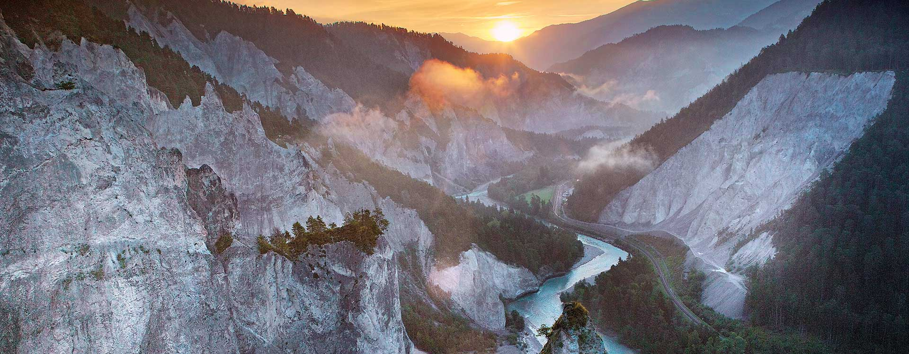
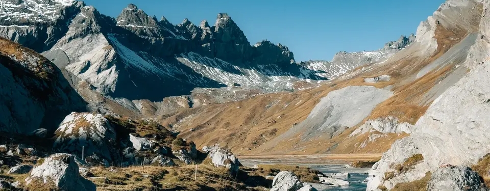
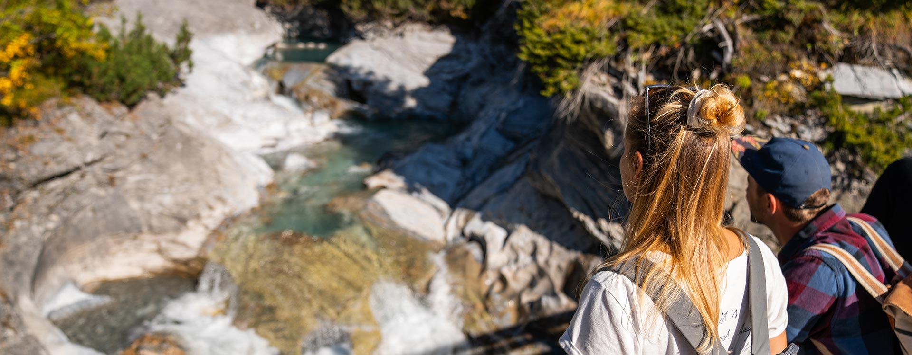



# Activities

In addition to the main User Conference and the Contributor Meeting we also offer a number of additional activities.
This page lists all offered activities, including the main conference and the contributor meeting.

See also the [schedule](/schedule) for more information about times.

We reserve the right to cancel any of the social activities if there are too few participants for it.



# Mens sana in corpore sano

Kick-start each day with guided activities around **Laax** to get moving before the sessions. Check the schedule for daily times and meeting points.

Unless noted otherwise, activities are **free** and require **no registration**.






## Sunday - Outdoor Day

Sunday is an informal outdoor day with guided hiking trips and possibly other sports. We will offer multiple distances to suit different fitness levels.

Time: Sunday 4th of October 
Place: Laax Murschetg 
Price: **€40**, registration required — covers transportation and guide fees. 

You can choose your activity after purchase. Tickets can be purchased together with your conference ticket on [ti.to/qgis/uc-2026](https://ti.to/qgis/uc-2026).






### Rhine Gorge – Easy (2h walk)

**Ruinaulta Rhine Gorge walk with guide**

[More info](https://www.flimslaax.com/en/outdoor-activities/natural-phenomena/rhine-gorge) | [View route](https://routeplanner.suunto.com/?route=qgis-uc-reinschlucht-1775594627354&style=outdoor&bottomBar=open)

We take the bus from Laax to Valendas-Sagogn and walk the most scenic stretch of the Ruinaulta, the so-called "Swiss Grand Canyon." A local Ruinaulta guide joins us for the full walk, bringing the gorge's story to life along the way.

Some 9,450 years ago, over 7 cubic kilometres of rock broke loose above Flims and plunged into the Vorderrhein valley. The Rhine dammed up, forming a lake that persisted for around 1,000 years before the river slowly carved its way through the debris to create today's gorge. The wild, natural gorge with its open gravel banks is a habitat for rare birds, and the forests are known for an unusual variety of orchids.

The trail from Valendas to Versam runs directly along the Rhine, through floodplain forests, across meadows and past white pebble beaches. At Versam-Safien we hop on the Rhaetian Railway to Ilanz, then bus back to Laax.

**4.6 km, +52 m / -80 m** — Easy, suitable for all fitness levels.

Time: 9:30–14:00






### UNESCO Hike – Short (3h walk)

**Segnes Plateau hike with GeoRanger**

[More info](https://www.flimslaax.com/en/outdoor-activities/natural-phenomena/tectonic-arena-sardona) | [View route](https://routeplanner.suunto.com/?route=segnes-short-1775593384542&style=outdoor&bottomBar=open)

We meet in Laax and take the bus up to Berghaus Nagens (2100 m), then walk into the Segnesboden, looping through the open karst plateau before stopping for a well-earned drink or lunch at Segneshütte (not included). From there we descend to Stalla and take the bus back to Laax.

A certified Sardona GeoRanger will guide the group through the geology of the UNESCO World Heritage Tectonic Arena Sardona, where the Glarus Thrust brings ancient rocks to rest on top of much younger ones — a textbook case visible right beneath your feet.

The perfect way to clear your head the day before three days of QGIS talks.

**7.5 km, +127 m / -297 m** — Easy to moderate, suitable for all fitness levels.

Time: 9:30–15:00






### UNESCO Hike – Long (5h)

**Segnes Plateau hike with GeoRanger (long option)**

[More info UNESCO](https://www.flimslaax.com/en/outdoor-activities/natural-phenomena/tectonic-arena-sardona) | [More info Trutg dil Flem](https://www.flimslaax.com/en/hiking/trutg-dil-flem) | [View route](https://routeplanner.suunto.com/?route=qgis-uc-2026---segnes---trutg-dil-flem-1775602204894&style=outdoor&bottomBar=open)

We meet in Laax and take the bus up to Berghaus Nagens (2100 m), then walk into the Segnesboden, looping through the open karst plateau before stopping for a well-earned drink or lunch at Segneshütte (not included).

From there we join the Trutg dil Flem ("riverside trail" in Romansh), following the Flem river from its source on the upper Segnesboden all the way down to Flims village. The trail cuts through narrow gorge landscapes past waterfalls, water mills and bizarre rock formations, all carved through Europe's largest landslide. Seven bridges designed by Graubünden engineer Jürg Conzett punctuate the descent, each one a distinct piece of functional design. The trail ends in the centre of Flims, where you can grab a coffee or jump on the bus back to Laax.

A certified Sardona GeoRanger will guide the group through the geology of the UNESCO World Heritage Tectonic Arena Sardona, where the Glarus Thrust brings ancient rocks to rest on top of much younger ones — a textbook case visible right beneath your feet.

**14 km, +135 m / -1148 m** — Moderate to challenging, with a long descent. Hiking poles recommended.

Time: 9:30–17:00






## Monday - Preconf activation
TBD Activity on Crap Sogn Gion (Yoga4all, Small hike, ...?)






## Tuesday - Preconf activation
TBD Activity on Crap Sogn Gion (Yoga4all, Small hike, ...?)






## Wednesday - trailrun

6 Km run in the forrest to some fantastic view point. Mix of gravel roards and single trails. See the profile and route [here](https://routeplanner.suunto.com/?route=ault-la-mutta-run-1767565813390&style=outdoor)

Meeting point [Kiss&Ride parking in front of the Laax Bergbahnen bus stop](https://www.openstreetmap.org/#map=19/46.819735/9.265168).

We leave at 07:01 after the bus from Laax arrives






## Thursday - hike & fly

Hike & Fly, might be moved to other days depending on weather conditions.






## Friday - trailrun
Wonderful 10K trail run along the Connbächli to the Swiss grand Canyon view platform Il spir.

 See the profile and route [here](https://routeplanner.suunto.com/?route=connbchli---il-spir-1767566957418&style=outdoor&bottomBar=open)

Meeting point [Flims Waldaus Caumasee bus stop](https://www.openstreetmap.org/node/984706253#map=19/46.825889/9.288790).

We leave at 07:06 after the bus from Laax arrives (take the 7:02 Bus from Laax Murschetg)






## Individual Sports & Outdoor Activities

Laax offers a wide range of [outdoor sports and activities](https://www.flimslaax.com/en/outdoor-activities), making it easy to combine the conference with time in the mountains.

**Hiking & Trail Running**: Numerous marked trails start directly from Laax and Crap Sogn Gion, ranging from easy walks to more demanding alpine routes.

**Mountain Biking**: Laax and the surrounding region offer a large network of mountain bike trails, including lift-accessed routes and cross-country options.

**Paragliding**: Crap Sogn Gion is a popular paragliding launch site. Experienced pilots can fly directly from the venue down to the valley.

**Climbing & Via Ferrata**: Several climbing routes and via ferrata are available in the region, suitable for different skill levels.

**Water Sports**: Nearby lakes such as Lake Cauma and Lake Cresta offer opportunities for swimming, stand-up paddling, and relaxing after a conference day.

**Other activities**: Yoga, fitness facilities, and wellness options are available in Laax and the surrounding villages.






# Extended Conference activities






## Sunday

### Warm-up & Early Registration

Warm-up event on Sunday evening, where you can meet other participants and the organisers, and have a wine, beer or non-alcoholic drink (at your own expense).

We will have a registration desk there as well, in case you would like to avoid queuing for registration on Monday morning.

Time: Sunday 4th of October, 18:00-22:00 
Place: Laax Murschetg, Bar TBD
Price: Free, no registration required, everyone welcome






## Monday

### Preconf special event

TBD (Discover Mission control, How does a ski resort work, Gondola talks, ...)

### Main Conference

The main conference will be held on Monday and Tuesday, with a mix of presentations, workshops and networking
opportunities.

### Social Dinner

Join us for a social dinner on Monday night directly after the conference. The dinner is included in the price of your ticket.

Time: Monday 5th of October, 18:00 (easy start) 
Place: Galaaxy Mainstation 
Price: Included in the conference ticket






## Tuesday

### Preconf activation
TBD Activity on Crap Sogn Gion (Yoga4all, Small hike, ...?)

### Main Conference

The main conference will be held on Monday and Tuesday, with a mix of presentations, workshops and networking
opportunities.






## Wednesday

### Hands-on Workshops

While there will be workshops during the main conference, we additionally want to offer you the opportunity to attend
some half-day long workshops. Topics will be announced later, however the number of spots is limited so make sure to
get your ticket if you want to attend!

The price includes lunch after the workshops.

Time: Wednesday 7th of October, TBD with a coffee break 
Price: TBD, registration required






### QField Day

Want to learn more about QField, the mobile app for QGIS, in the town where it was born? Join us for a full-day QField experience combining indoor sessions with hands-on exploration in the field.

After a short indoor introduction and demo session, we will head outdoors for a guided hike, using QField along the way to explore the surrounding landscape, discover the region, and work through real-world field mapping workflows together.

Time: Wednesday 7th of October, 09:00–17:00 
Place: Laax Murschetg






### Onboarding Day

Want to get involved with the QGIS project? On the Wednesday there will additionally be several sessions for newcomers
to the project, or those who want to get more involved. Topics will be announced later.

Time: Wednesday 7th of October, times TBA 
Place: Färgeriet, Norrköping 
Price: Free, no registration required






### Contributor Meeting (until Friday)

The Contributor Meeting will be held on Wednesday through Friday, and is open to anyone who wants to contribute to QGIS.
Tackle bugs, write documentation, or help with translations, there is something for everyone!

See more information and register (not required but helps us ensure that there's enough food and t-shirts) on [GitHub](https://github.com/qgis/QGIS/wiki/28th-Contributor-Meeting-in-Norrk%C3%B6ping).

Time: Wednesday-Friday 7-9th of October, 08:30-17:00 
Place:  
Price: Free, open to everyone





