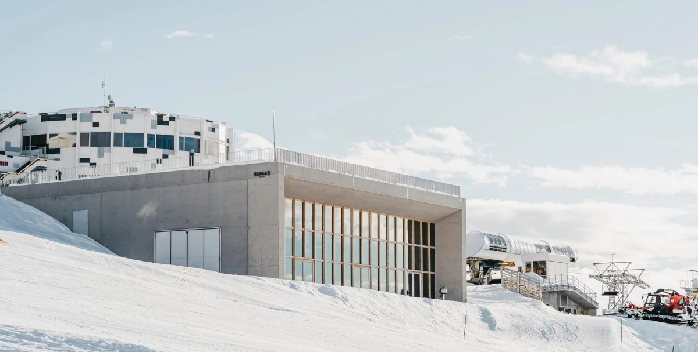
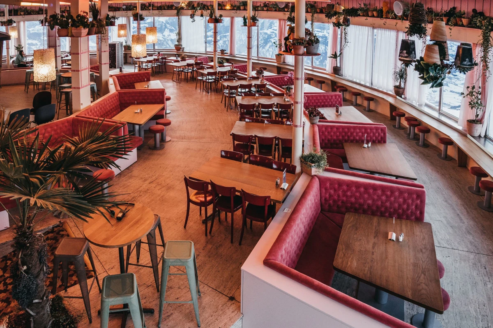
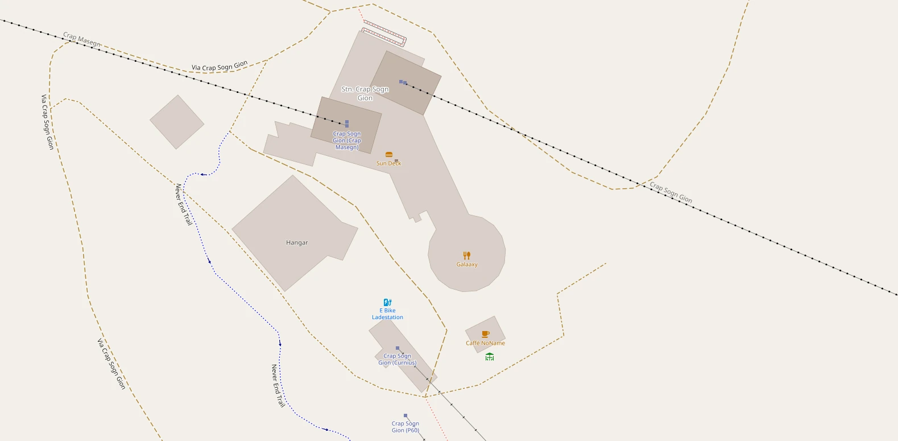


# Attending



## Quick facts

- Venue: LAAX Galaaxy, Crap Sogn Gion (2,222 m)  
- Dates: 5–6 October 2026  
- Workshops: 7 October (Laax Murschetg)  
- Contributor Meeting: 7–9 October (Laax Murschetg)  
  





## Tickets

Tickets go on sale in March. A limited number of Early-Bird tickets will be available at a reduced price.

All participants need a ticket for the conference, including speakers and workshop presenters. For more information see the [tickets page](/tickets/).



## The hosting region

The conference takes place in the Surselva valley, one of the few regions in Switzerland where the [Romansh language](https://en.wikipedia.org/wiki/Sursilvan) is still part of everyday life. You may notice that places here often carry more than one name, shaped by centuries of history and language. Mountain names, valleys, and landmarks frequently preserve older words, echoing the landscape they describe.

This linguistic diversity is woven into local culture and identity, appearing on signs, maps, and in everyday conversations throughout the region.



### Understanding local place names

- **Crap Sogn Gion**  
  The Romansh name of the mountain above Laax where the conference venue is located. *Crap* means “rock”, *Sogn* means “saint”, and *Gion* refers to Saint John.

- **Laax Murschetg**  
  The main arrival point for the conference and a primary accommodation area (Rocks Resort, Hotel Signina, Riders Hotel and many apartments). It is home to the gondola station and bus hub, making it a convenient base for attending the event. Bus stop: **Laax Bergbahnen**.

- **Laax (Laax town, Laax Dorf)**  
  The main village in the valley, offering shops, restaurants, services, some hotels and many apartments. It is connected to Laax Murschetg by a frequent, free local bus service. Bus stop: **Laax Posta**.

- **Flims/Flem**  
  A nearby village with additional accommodation options and services. Flims is well connected to Laax Murschetg by frequent public transport and free local buses.



### Maps

[OpenStreetMap](https://www.openstreetmap.org/#map=14/46.82273/9.27057&layers=N) and [swisstopo](https://s.geo.admin.ch/3fcf1x8b3cyw) offer excellent maps of the region. If you prefer a more pictorial map of Laax, Flims, and Falera, please refer to the [official tourist map (PDF)](https://www.flimslaax.com/fileadmin/Daten/Dokumente/PDF_flimslaax.com/Guides/Ortsplan_Flims_Laax_Falera.pdf). A photorealistic 3D visualisation of Laax Murschetg and the region can be found on the [rocksresort website](https://portfolio-overview5.beyonity.ch/?id=6D739C5E&lang=en-EN).

To complement these maps, the [official conference app](/apps/#conference-app) brings places and program together, helping you find venues, save favourite talks, and access essential information — even offline.




<iframe src="https://map.geo.admin.ch/#/embed?lang=en&center=2737885.19,1187771.4&z=4.977&topic=ech&layers=ch.swisstopo.swissimage-product@year=current,f;ch.bav.haltestellen-oev,f;ch.swisstopo.swisstlm3d-wanderwege,f;ch.astra.wanderland-sperrungen_umleitungen,f;ch.astra.mountainbikeland,f;ch.astra.veloland,f&bgLayer=ch.swisstopo.pixelkarte-farbe" style="border: 0; width:100%; height: 400px" allow="geolocation"></iframe>




<iframe src="https://www.openstreetmap.org/export/embed.html?bbox=9.229846000671388%2C46.79544697496532%2C9.292931556701662%2C46.83262927748744&amp;layer=mapnik" style="border: 0; width:100%; height: 400px" allow="geolocation"></iframe>




## Venue



### LAAX Galaaxy, Crap Sogn Gion

The event will be held at [**LAAX Galaaxy**](https://www.galaaxylaax.com/) on **Crap Sogn Gion**, at **2,222 m above sea level**, in the heart of the Swiss Alps.

Set right next to the [**Tectonic Arena Sardona**](https://www.flimslaax.com/en/outdoor-activities/natural-phenomena/tectonic-arena-sardona) UNESCO World Heritage Site, the venue offers panoramic views over the surrounding mountain landscape of the Surselva valley, one of the few [Romansh-speaking](https://en.wikipedia.org/wiki/Sursilvan) regions in Switzerland.






Beyond the conference, the region is a true [outdoor playground](https://www.flimslaax.com/en/outdoor-activities/). Participants can enjoy **mountain biking**, **hiking**, and **paragliding** flights directly from the venue, and take refreshing breaks at [**Caumasee**](https://www.flimslaax.com/en/outdoor-activities/mountain-lakes/lake-cauma), one of Switzerland's most iconic mountain lakes. Nearby, the [**Rhine Gorge**](https://www.flimslaax.com/en/outdoor-activities/natural-phenomena/rhine-gorge), often called the Swiss Grand Canyon, adds another spectacular highlight with its dramatic cliffs and turquoise waters.





### Active options

- Reach the venue on foot or by bicycle: ~7 km, 1,200 m elevation gain  
- Experienced pilots can paraglide down to Laax, landing close to hotels in the valley






### Important note

Laax town (Laax Posta) is not the venue location. It is a 5-minute free bus ride from Laax Murschetg, with frequent connections throughout the day. The correct bus station is Laax, Bergbahnen





## Rooms





### Plenary sessions

All plenary sessions will be held in the [Hangar](https://www.laax.com/meeting/locations-hangar).








### Talks and short workshops

Presentations will take place in the **Hangar**, **Capalari**, and the [Galaaxy conference venue](https://www.galaaxylaax.com/event-location/).

All rooms are located in or around the **Crap Sogn Gion** building and are reachable within **2–3 minutes on foot**.







### Breaks

**Coffee breaks**, **lunch**, the **sponsors exhibition**, and the **social event** will be held at the [Galaaxy Main Station](https://www.laax.com/en/restaurant/galaaxy-main-station).

















## Workshops

Workshops will be held in Laax Murschetg (no gondola required).

Details and locations are TBD.





## Contributor Meeting

The Contributor Meeting will be held in **Laax Murschetg** (no gondola required), in a dedicated space (Diva 1) close to the hotels.




## Getting there





### By train

Chur is very well connected by rail, with frequent direct services from major Swiss cities and international destinations.

There are direct train connections to **Hamburg** and **Stockholm** with only **one change**.

A **direct train from Brig** is also available, offering a particularly scenic journey along the **Glacier Express route**.










### By plane

Zurich is Switzerland’s largest airport, with connections worldwide.

From Zurich Airport, regular trains run to **Chur**, followed by a bus to **Laax Murschetg (Laax Bergbahnen)**. Hotels are located **2–3 minutes from the bus stop**.

From Laax Murschetg, the venue at **Crap Sogn Gion** is reached by gondola.  
Total travel time is approximately **2.5–3 hours**.





### By bus

Regional buses connect **Ilanz** and **Chur** to **Laax Murschetg (Laax Bergbahnen)**.  
All local buses between **Laax town (Laax Posta)** and **Laax Murschetg** are **free of charge** and run frequently.

### By car

Laax is accessible via the **A13 motorway** (exit **Reichenau**), followed by a scenic mountain road.  
Parking is available in **Laax Murschetg**, close to the gondola station.

## Getting around





### Walk

Once at Crap Sogn Gion, all conference facilities are within easy walking distance. The valley itself is a walker's paradise—numerous marked trails wind through alpine meadows and forests, from gentle strolls to more challenging alpine hikes, with breathtaking views at every turn. It's easy to explore the stunning landscape before or after sessions. 







### Bike

Mountain biking is fantastic in this region! Lift-accessed trails, cross-country routes, and single-track adventures await riders of all levels. Bike rental is available locally, making it easy to explore the stunning terrain between sessions.










### Bus

A frequent free local bus service connects Laax Murschetg with Laax town (Laax Posta) in about 5 minutes, and also with nearby villages such as Flims and Falera.







### Gondola

Daily access to the venue is via the gondola from Laax Murschetg. Operating times will be shared closer to the event.





## Code of Conduct




The QGIS community Code of Conduct applies to all attendees, speakers, sponsors, volunteers, and staff at the QGIS User Conference. Please follow the policy and reporting instructions at [https://qgis.org/conduct](https://qgis.org/conduct).

If you experience or witness unacceptable behaviour, report it to event staff or a member of the local committee so we can respond promptly.





